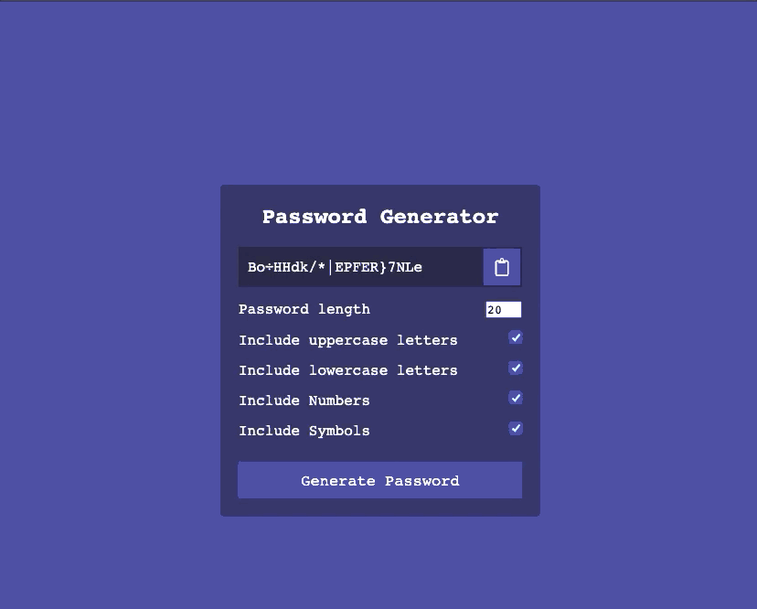

# Password Generator App

In this project, I am trying to make a password generator in which a user can create custom strong passwords and copy them in order to use them other websites or platforms.

  

## Idea
- Get All Symbol Characters ( @#$½§ etc.) - true-false
- Get All Numbers ( 1265 etc. ) - true-false
- Get Characters ( abcABC etc. ) - true-false
- Get Length of the password ( 17 etc. ) - required
- At least one option must be selected if not toast error message
- Add All Include Characters to Array
- Loop to That length
  - Get Random Index between 0-(length-1)
  - Using That Index get that character characters[index]
  - add that character to new password
- Copy That Password To Clipboard

## You can reach out 😊😊
Feel free to contact me about the problems. I will try to help as much as I can 😉

