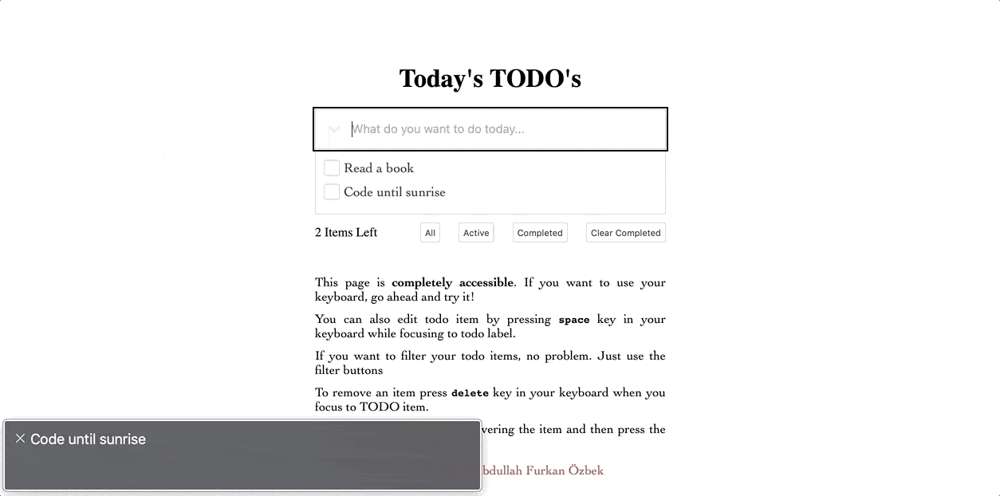
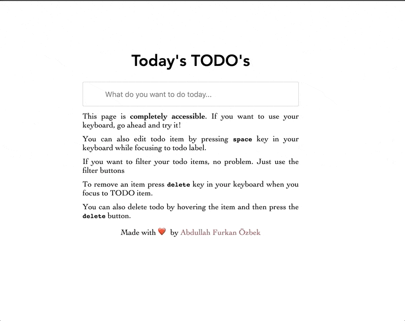

# Todo App

[Live Project](https://todo.furkanozbek.com/)

## Installing

> run `yarn install` or `yarn start`

## Deployment

You can easily deploy the project over [Netlify](https://www.netlify.com/) or `github-pages`. Check out the documentation

## Built With

- [React](https://tr.reactjs.org/) - UI library for js
- [React Hooks](https://reactjs.org/docs/hooks-intro.html)
- [Redux](https://redux.js.org/) - State Management
- **Redux Persistent** - Save the application state locally or remotely
- Accessibility Features, ARIA - User Experience improved
- [Sass](https://sass-lang.com/) - Sass is the most mature, stable, and powerful professional grade CSS extension language in the world.

## Contributing

- If you have problems please leave an `issue` from [here](https://github.com/afozbek/react-todo-app/issues)
- Consider forking the project and submitting new `pull requests`. I am much likely control [my github account](https://github.com/afozbek).

## License

This project is licensed under the MIT License - see the [LICENSE](LICENSE) file for details
